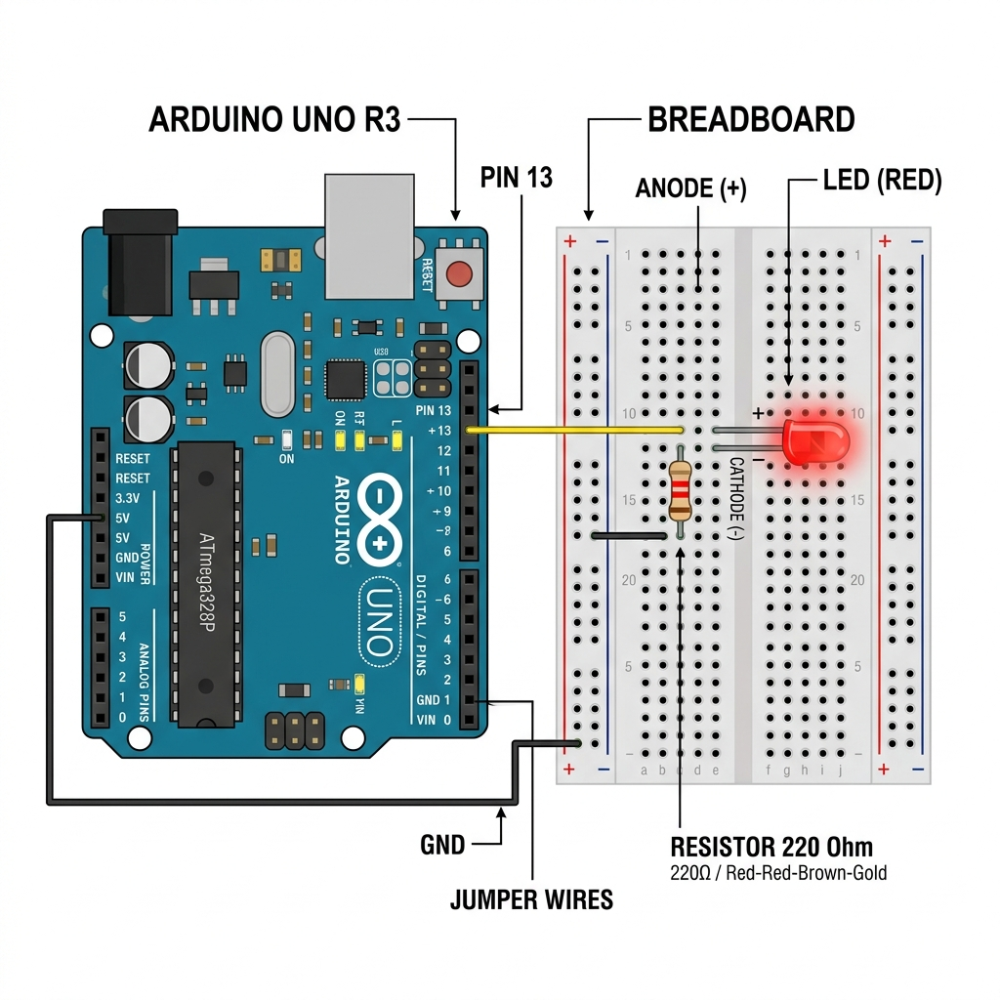

# Bab 1: IoT Basic (Blink Test)

Selamat datang di modul **Bab 1: IoT Basic**. Pada bab ini, kita akan mempelajari konsep dasar *Input/Output* (I/O) digital pada perangkat microcontroller serta cara melakukan pengujian awal menggunakan program **Blink**.

---

## 📋 Deskripsi Proyek
Proyek ini dirancang untuk memastikan bahwa lingkungan pengembangan (Arduino IDE), driver board microcontroller (seperti Arduino Uno, NodeMCU, atau WeMos D1 R2/Mini), serta kabel data berfungsi dengan baik. Kami menggunakan LED bawaan (*built-in LED*) untuk meminimalkan kebutuhan komponen tambahan di tahap pengujian awal ini.

## 🛠️ Komponen yang Dibutuhkan
1. **Microcontroller Board** (Arduino Uno / NodeMCU ESP8266 / WeMos D1)
2. **Kabel USB Data** (sesuai tipe interface board)
3. **Komputer/Laptop** dengan Arduino IDE yang sudah terinstal

---

## 🔌 Diagram Pengkabelan (Wiring)
Berikut adalah referensi diagram pemasangan komponen untuk uji coba menggunakan LED eksternal (opsional):

> [!NOTE]
> Jika menggunakan LED eksternal, pastikan untuk menggunakan resistor pembatas arus (resistor $220\Omega$ - $330\Omega$) agar LED tidak rusak akibat kelebihan tegangan/arus.

---

## 💻 Langkah-Langkah Uji Coba

1. **Persiapan Perangkat**:
   Hubungkan microcontroller Anda ke port USB komputer menggunakan kabel data.
2. **Konfigurasi Arduino IDE**:
   - Buka file `src/blink_test.ino` menggunakan Arduino IDE.
   - Masuk ke menu **Tools** -> **Board**, pilih board yang sesuai dengan perangkat Anda (misal: *Arduino Uno* atau *Generic ESP8266 Module*).
   - Pilih port komunikasi yang sesuai di bawah menu **Tools** -> **Port**.
3. **Upload Kode**:
   Klik tombol **Upload** (ikon panah kanan) pada Arduino IDE dan tunggu hingga status berubah menjadi *Done uploading*.
4. **Verifikasi**:
   Perhatikan LED internal pada board Anda. Jika LED berkedip hidup dan mati dengan interval 1 detik, maka langkah uji coba berhasil!

---

*Pusat Studi Multimedia & Robotika (PSMURO) - Universitas Gunadarma*
